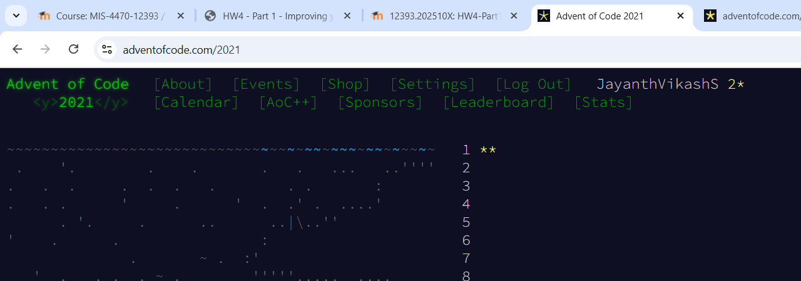

# HW4 – Advent of Code: Sonar Sweep 🚢

This repository contains my solutions for **Homework 4 – Part 1** of the PCDA course, based on the **Advent of Code 2021** programming puzzles. The goal was to solve Day 1 (Parts 1 & 2) using Python.

---


##  GitHub Repository

This project is tracked using Git and hosted on GitHub: [https://github.com/JayanthVikashS/adventofcode](https://github.com/JayanthVikashS/adventofcode)

---


## ▶️ How to Run the Code

1. Open a terminal in the respective folder (`part_1` or `part_2`)
2. Make sure the corresponding `input.txt` file is present
3. Run the Python script using:

```bash
python part_1.py
# or
python part_2.py
```

---

## 🖼️ Screenshot

Below is a screenshot of my Advent of Code profile showing both stars earned for Day 1:


